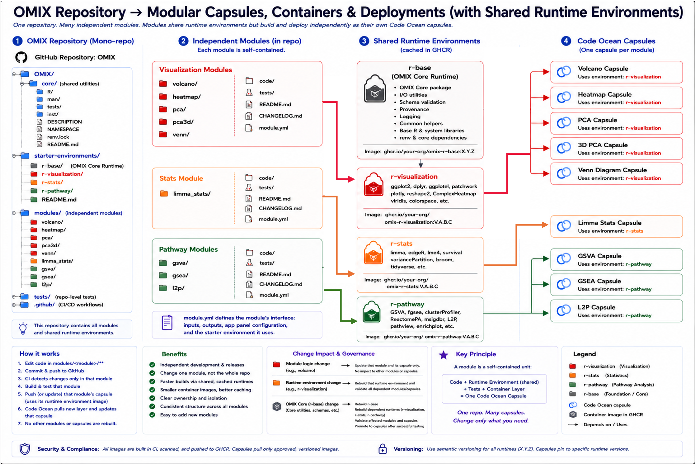
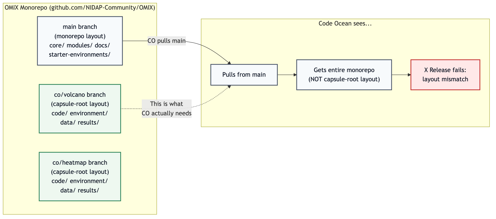
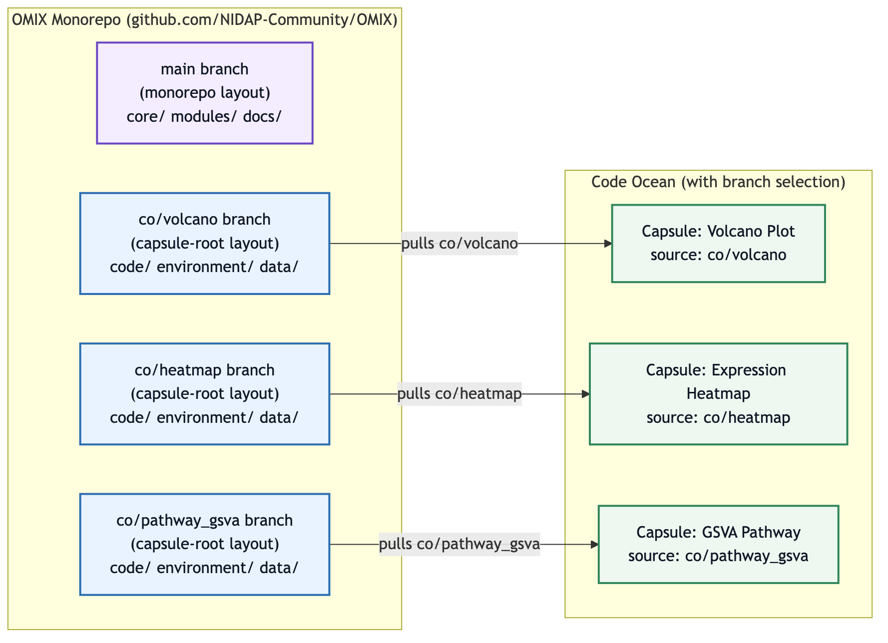
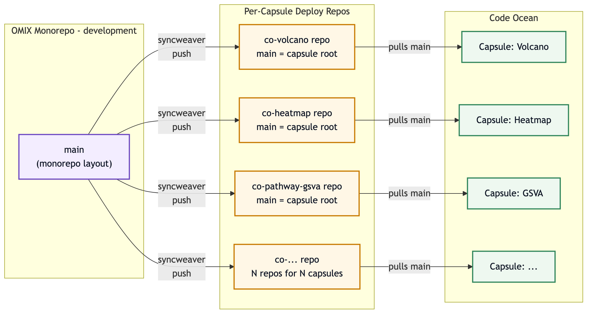
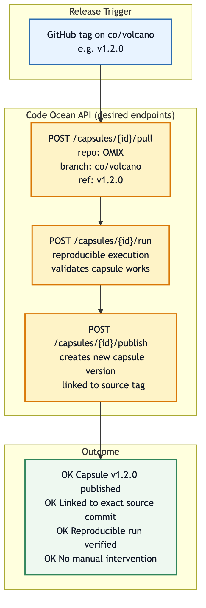

# OMIX Monorepo Architecture for Code Ocean Integration

```{=openxml}
<w:sdt>
  <w:sdtContent>
    <w:p>
      <w:r>
        <w:fldChar w:fldCharType="begin"/>
      </w:r>
      <w:r>
        <w:instrText> TOC \o "1-3" \h \z \u </w:instrText>
      </w:r>
      <w:r>
        <w:fldChar w:fldCharType="separate"/>
      </w:r>
      <w:r>
        <w:t>Right-click and select "Update Field" to generate table of contents.</w:t>
      </w:r>
      <w:r>
        <w:fldChar w:fldCharType="end"/>
      </w:r>
    </w:p>
  </w:sdtContent>
</w:sdt>
```

## Executive Summary

OMIX is a monorepo that organizes bioinformatics analysis modules — such as volcano plots, heatmaps, pathway analysis, and statistical testing — into self-contained units that can be deployed as Code Ocean capsules. The architecture supports:

- Shared runtime environments across related capsules (e.g., all visualization modules share one container image)
- Bidirectional synchronization between the monorepo and Code Ocean capsules
- Per-module parallel development without global locks
- Selective updates: only capsules affected by an upstream change are rebuilt
- A patching system so analysts can maintain capsule-local modifications while receiving upstream updates

### Architecture Overview

{width=6in}

---

## Repository Layout

```
OMIX/
├── core/                          # Shared scientific R package (param loading, I/O, schema validation)
├── modules/
│   ├── volcano/                   # Thin wrapper — calls EnhancedVolcano
│   ├── heatmap/                   # Calls ComplexHeatmap via omixcore utilities
│   ├── pca/                       # PCA visualization
│   ├── pathway_gsva/              # GSVA pathway scoring
│   ├── pathway_gsea/              # GSEA preranked analysis
│   ├── stats_limma/               # Differential expression via limma
│   └── ...
├── starter-environments/          # Shared container images (4 tiers)
│   ├── r-base/                    # Core R + omixcore
│   ├── r-visualization/           # ggplot2, ComplexHeatmap, plotly
│   ├── r-stats/                   # limma, edgeR, survival
│   └── r-pathway/                 # GSVA, fgsea, clusterProfiler
├── scripts/                       # Sync tooling and repo governance checks
├── tests/                         # Monorepo-wide contract validation
└── docs/
```

Each module contains:

- `module.yml` — declares the module entrypoint (`runtime/run.sh` for platform-ready modules)
- `module.yml` — declares which shared runtime environment it uses
- `tests/` — smoke tests and validation scripts
- `schemas/` — input/output JSON schemas

---

## CO-Specific Files vs. Portable OMIX Files

Code Ocean integration files are part of the repo's deployment architecture. They do not require a separate "clean" repo as long as generated outputs, production data, and local platform state remain excluded.

| File or folder | Role | Needed outside Code Ocean? | Keep in monorepo? |
|----------------|------|----------------------------|-------------------|
| `core/` | Shared scientific/runtime OMIX R package | Yes | Yes |
| `scripts/lib/module_governance.R` | Module contract and version governance helpers | No, repo governance only | Yes |
| `modules/*/R/`, `modules/*/runtime/code/`, and active `modules/*/code/` scaffold entrypoints | Module implementation and entrypoints | Yes | Yes |
| `modules/*/schemas/` and `modules/*/tests/` | Input/output contracts and validation | Yes | Yes |
| `modules/*/module.yml` | Module contract, runtime tier, deployment image metadata | Yes | Yes |
| `starter-environments/*/Dockerfile` and `renv.lock` | Shared runtime image definitions | Yes, for local/HPC/container builds | Yes |
| `modules/*/runtime/` | Capsule-root-style runnable bundle for platform-ready modules | Sometimes, useful for local smoke tests and CO export | Yes |
| `scripts/code_ocean_sync.sh` | Layout projection between monorepo and capsule-root layout | No, CO-facing | Yes |
| `.github/workflows/*cosync*`, `auto-refresh-export.yml`, `promote-mod-to-main.yml` | Sync, refresh, and promotion automation | No, CI/deployment-facing | Yes |
| `docs/code-ocean-sync*.md`, `docs/github-sync-flow.mmd` | Architecture and process documentation | Yes, for maintainers | Yes |
| `modules/*/runtime/data/example_inputs/` | Tiny test fixtures | Yes | Yes |
| `data/**` production inputs | User or study data | No | No |
| `results/**` generated outputs | Run products | No, except `results/README.md` | No |
| `.codeocean/` on `co/*` branches | Code Ocean platform metadata, including app-panel, dataset, and resource JSON | No | No, branch-local only |
| `.DS_Store`, temp office lock files | Local editor state | No | No |

The clean boundary is therefore not "remove Code Ocean files." The clean boundary is "track source, contracts, runtimes, sync logic, docs, tests, and tiny fixtures; exclude production data, generated outputs, and local state."

### Code Ocean Branch-Local Files

For the Volcano capsule, the generated `co/volcano` branch contains the flattened runtime payload plus Code Ocean platform metadata:

| Source in `main` | Location on `co/volcano` |
|------------------|--------------------------|
| `modules/volcano/runtime/README.md` | `README.md` |
| `modules/volcano/runtime/run.sh` | `run.sh` |
| `modules/volcano/runtime/code/` | `code/` |
| `modules/volcano/runtime/data/README.md` and `data/example_inputs/` | `data/` |
| `modules/volcano/runtime/docs/` | `docs/` |
| `modules/volcano/runtime/environment/` | `environment/` |
| `modules/volcano/runtime/metadata/` | `metadata/` |
| `modules/volcano/runtime/tests/` | `tests/` |

The following files may exist only on the capsule branch and are intentionally not reverse-synced to `main`:

| Branch-only file | Purpose |
|------------------|---------|
| `.codeocean/app-panel.json` | Current Code Ocean app-panel configuration |
| `.codeocean/datasets.json` | Code Ocean dataset attachment metadata |
| `.codeocean/resources.json` | Code Ocean resource metadata |
| `.github/workflows/auto-cosync-pr.yml` | Allows `[sync]` commits from the capsule branch to open reverse-sync PRs |

For now, the live Code Ocean app-panel state lives under `.codeocean/` on the `co/volcano` branch and remains branch-local by design. `main` does not keep empty `modules/*/app-panel/` placeholders. If the team later wants app-panel configuration to be managed from the monorepo, those source files should be added intentionally with clear sync rules.

---

## How This Differs from Sparse Checkout

People sometimes refer to our workflow as a "sparse checkout," but the pattern is fundamentally different.

### Sparse Checkout (what we are NOT doing)

Git sparse-checkout is a client-side working tree filter. You clone the full repo but only materialize a subset of files on disk. The paths and structure remain identical — it's just a visibility filter.

### Bidirectional Layout Projection (what we ARE doing)

Our synchronization transforms the file layout between two incompatible structures:

| Monorepo path | Capsule path |
|---------------|--------------|
| `modules/volcano/runtime/code/main.R` | `code/main.R` |
| `modules/volcano/runtime/tests/` | `tests/` |
| `modules/volcano/runtime/docs/` | `docs/` |
| `starter-environments/r-visualization/` | `environment/` (or referenced image) |
| `core/` | Installed as R package in image |

The file paths change. Metadata is excluded. The two layouts cannot be merged directly. This is a **bidirectional projection** — analogous to Google's Copybara tool for syncing between internal monorepos and public repositories.

### Key Properties

| Property | Sparse Checkout | Our Architecture |
|----------|----------------|------------------|
| Same file paths? | Yes (subset) | No (transformed) |
| Same repository? | Yes | Yes (different branches) |
| Bidirectional? | No (read-only filter) | Yes (outbound + reverse sync) |
| Requires sync logic? | No | Yes |
| Semantic exclusions? | No | Yes (no results, no production data, no .codeocean) |
| Layout awareness? | None | Monorepo ↔ capsule-root translation |

---

## Shared Runtime Environments

Modules are grouped into runtime tiers. Each tier is a published container image:

```
┌─────────────────────────────────────────────────────┐
│ ghcr.io/nidap-community/omix-r-base:1.0             │
│   R 4.4+, omixcore, renv, schema validation         │
└─────────────────────────────────────────────────────┘
        │ extends
        ├──────────────────────────────────────────────┐
        │                                              │
┌───────┴──────────────────┐   ┌───────────────────────┴──────┐
│ omix-r-visualization:1.0 │   │ omix-r-pathway:1.0           │
│  ggplot2, ComplexHeatmap │   │  GSVA, fgsea, clusterProfiler│
│  EnhancedVolcano, plotly │   │  ReactomePA, msigdbr         │
└──────────────────────────┘   └──────────────────────────────┘
  Used by: volcano,              Used by: pathway_gsva,
  heatmap, pca, pca3d, venn      pathway_gsea, l2p_single
```

**Benefit for Code Ocean:** All visualization capsules share one environment. Updating `EnhancedVolcano` from 1.22 to 1.23 means rebuilding one image — not rebuilding 6 separate capsule environments.

---

## Module Tiers: Packages vs. Script Modules

Not every module needs to be a full R package. The packaging overhead should be proportional to the module's complexity, reuse surface, and maintenance needs.

### The Two Tiers

| Tier | Structure | Testing | Versioning | Example |
|------|-----------|---------|------------|---------|
| **Script module** | `main.R` + helper functions + `module.yml` | Smoke test only | Git tag on monorepo | volcano, basic heatmap, venn diagram |
| **Package module** | Full R package (DESCRIPTION, NAMESPACE, `R/`, `man/`) | `R CMD check` + `testthat` | DESCRIPTION version field | omixcore, complex pathway scoring |

### When to Use a Script Module

Use a script module when **all** of the following are true:

- The module is a thin wrapper around an existing package (e.g., calling `EnhancedVolcano::EnhancedVolcano()` with parameters)
- It has 1–3 functions, typically in one or two files
- No other module or capsule imports functions from it
- The logic is straightforward enough that a smoke test validates it
- You don't need to generate documentation with roxygen2
- Versioning by git tag (e.g., `volcano/v1.0.0`) is sufficient

**Script module structure:**

```
modules/volcano/
  code/main.R                    # Entrypoint (~50–100 lines)
  code/functions/helpers.R       # Optional helper functions
  module.yml                     # Declares runtime environment, inputs, outputs
  tests/test_run_small.sh        # Smoke test with example inputs
  schemas/inputs.schema.json     # Input contract
  schemas/outputs.schema.json    # Output contract
```

**What you get:** Low overhead, easy to write, easy to review, fast CI.

**What you give up:** No `roxygen2` docs, no `NAMESPACE` isolation, no `R CMD check`, no `testthat` unit tests (only integration-level smoke tests), no `remotes::install_github()`.

### When to Use a Package Module

Use a package module when **any** of the following are true:

- The module contains substantial logic (>200 lines of non-boilerplate R code)
- Multiple capsules or other modules import functions from it
- You need versioned releases with semantic versioning tracked in `DESCRIPTION`
- The functions have complex edge cases that need unit testing beyond a smoke test
- You want `roxygen2`-generated documentation
- External users should be able to install it via `remotes::install_github()`
- functracer needs to trace through it as a dependency boundary (NAMESPACE exports)

**Package module structure:**

```
modules/pathway_gsva/
  DESCRIPTION                    # Version, dependencies, metadata
  NAMESPACE                      # Generated by roxygen2
  R/                             # Exported and internal functions
    run_gsva.R
    score_pathways.R
    filter_gene_sets.R
  man/                           # roxygen2-generated docs
  tests/
    testthat/
      test-run_gsva.R
      test-score_pathways.R
    test_run_small.sh            # Integration smoke test
  module.yml                     # Runtime environment, CO config
  schemas/
```

**What you get:** `R CMD check` validation, unit tests, proper documentation, installable via `remotes::install_github("NIDAP-Community/OMIX", subdir = "modules/pathway_gsva")`, NAMESPACE isolation prevents accidental name collisions, functracer can trace exports precisely.

**What you give up:** More files to maintain, roxygen rebuild step, must pass `R CMD check` on every PR.

### Decision Flowchart

```
Is the module just calling one existing package function with parameters?
  → YES: Script module
  → NO: ↓

Does the module contain >3 functions or >200 lines of custom logic?
  → YES: Package module
  → NO: ↓

Do other modules or capsules import functions from it?
  → YES: Package module
  → NO: ↓

Does it need unit tests beyond "main.R runs without error"?
  → YES: Package module
  → NO: Script module
```

### The `omixcore` Package

`omixcore` is always a package. It provides shared scientific/runtime utilities consumed by all modules:

- Parameter loading and validation
- Output writing (standardized formats)
- Schema validation helpers
- Common data transformations

Repo governance logic, such as module contract validation and version/changelog enforcement, lives under `scripts/` rather than `core/`.

Because every module depends on it, it must have:
- Stable versioned API (DESCRIPTION version)
- Exported functions with documentation
- Unit tests for each utility
- `R CMD check` passing at all times

### Where External Packages (MOSuite, SCWorkflow) Fit

MOSuite and SCWorkflow are **external** packages — they live in their own repos, have their own release cycles, and are installed as dependencies. They are never part of the OMIX monorepo.

Modules consume them like any other CRAN or GitHub package:

```r
# In a script module's main.R:
library(MOSuite)
result <- MOSuite::run_differential_expression(params)

# In a package module's DESCRIPTION:
Imports:
    MOSuite (>= 2.0.0),
    SCWorkflow (>= 1.5.0)
```

The key distinction:

| Code location | Role | Versioning | Who maintains |
|---------------|------|------------|---------------|
| `modules/volcano/runtime/code/main.R` | Capsule entrypoint (script) | Git tag | OMIX team |
| `core/R/load_params.R` | Shared utilities (package) | DESCRIPTION | OMIX team |
| `MOSuite::filter_counts()` | Domain library (external package) | Own DESCRIPTION | MOSuite maintainers |
| `EnhancedVolcano::EnhancedVolcano()` | Upstream CRAN/Bioc package | CRAN version | Community |

### How functracer Interacts with Each Tier

| Tier | What functracer traces | Granularity |
|------|----------------------|-------------|
| Script module | `source()` calls and `library()` calls in `main.R` | File-level |
| Package module | `NAMESPACE` exports used by downstream code | Function-level (precise) |
| External package | Exported functions called by modules | Function-level (precise) |

Package modules give functracer **better precision** because NAMESPACE explicitly declares what's exported vs. internal. Script modules require functracer to parse `source()` chains, which is more fragile.

This is another reason to package a module if it's consumed by others: the dependency boundary becomes machine-readable.

### Evolving a Script to a Package

A module may start as a script and later need packaging. The migration path:

1. `usethis::create_package("modules/my_module")` inside the existing directory
2. Move helper functions from `code/functions/` into `R/`
3. Add `@export` roxygen tags to public functions
4. Add `DESCRIPTION` with dependencies and version
5. Run `devtools::document()` to generate NAMESPACE and man pages
6. Add `testthat` tests alongside existing smoke test
7. Update CI to detect the new DESCRIPTION and run `R CMD check`

The `module.yml`, `schemas/`, and smoke test remain unchanged. The capsule's `main.R` may simplify to:

```r
library(mymodule)
params <- omixcore::load_params("params.yaml")
mymodule::run(params)
```

### CI Behavior by Tier

```yaml
# In module-ci.yml:
- name: Run R CMD check for package modules
  run: |
    for MODULE in $CHANGED_MODULES; do
      if [ -f "modules/${MODULE}/DESCRIPTION" ]; then
        R CMD build "modules/${MODULE}"
        R CMD check "modules/${MODULE}"*.tar.gz --no-manual
      fi
    done

- name: Run smoke tests for all changed modules
  run: |
    for MODULE in $CHANGED_MODULES; do
      TEST="modules/${MODULE}/tests/test_run_small.sh"
      if [ -f "$TEST" ]; then
        bash "$TEST"
      fi
    done
```

Script modules get only the smoke test. Package modules get both `R CMD check` and the smoke test.

---

## Synchronization Architecture

### Branch Hierarchy

```
main (protected, monorepo source of truth)
  └── mod/<module> (per-module integration branch, tracks main)
       ← co-sync/<module>-* PRs land here (auto-merged when CI passes)
       → promotion PRs batch changes to main

co/<module> (persistent, capsule-root layout for Code Ocean)
  → [sync] commits trigger reverse sync into mod/<module>
  ← auto-refresh from main keeps capsule current
```

### Key Design Decisions

1. **Per-module parallelism:** Multiple modules can sync simultaneously without blocking each other. The duplicate-PR guard is scoped per-module, not global.

2. **Integration branches (`mod/<module>`):** Decouple fast Code Ocean iteration from the protected `main` branch. Analysts can push multiple `[sync]` commits that auto-merge into `mod/<module>` without waiting for human review.

3. **Batched promotion:** Changes accumulate on `mod/<module>` and are promoted to `main` in reviewed batches (daily or on-demand).

4. **Auto-refresh:** When `main` changes, affected `co/<module>` branches are automatically updated, keeping Code Ocean capsules fresh.

5. **No direct PRs from `co/<module>` to `main`:** The layouts are incompatible. All reverse-sync goes through the layout-aware projection tooling.

### `main` Remains the Authoritative Source of Truth

The `co/<module>` branches are **derived artifacts** — they are generated from `main` by the sync tooling, not maintained independently. GitHub Actions ensure this relationship is preserved in both directions:

- **Outbound (main → capsule):** When code on `main` changes, the `auto-refresh-export` workflow regenerates the affected `co/<module>` branches automatically. The capsule branch is always a projection of `main`, never ahead of it in ways `main` doesn't know about.
- **Inbound (capsule → main):** When an analyst edits code inside a Code Ocean capsule and pushes a `[sync]` commit, GitHub Actions reverse-sync that change through `mod/<module>` and eventually promote it to `main` via a reviewed PR.

At no point does `main` lose authority. The capsule branches exist solely as a layout-transformed view for Code Ocean's consumption. If a `co/<module>` branch were deleted, it could be fully regenerated from `main` at any time.

This is distinct from sparse checkout in an important way: sparse checkout is a client-side visibility filter that shows a subset of files at their original paths. Our approach is a **bidirectional layout projection** — file paths change, directories are restructured, metadata is excluded, and the two layouts cannot be merged directly. The sync tooling (`code_ocean_sync.sh` today, syncweaver in the future) handles the translation in both directions.

---

## Tooling: functracer and syncweaver

### functracer (planned)

An R package that statically traces function dependencies from a capsule's `main.R`:

**Input:** `modules/volcano/runtime/code/main.R`

**Output:** `modules/volcano/DEPS.json`

```json
{
  "module": "volcano",
  "direct_calls": [
    "EnhancedVolcano::EnhancedVolcano",
    "omixcore::load_params",
    "omixcore::write_output"
  ],
  "transitive_calls": [
    "ggplot2::ggplot",
    "ggrepel::geom_text_repel"
  ],
  "source_packages": {
    "omixcore": "0.2.0",
    "EnhancedVolcano": "1.22.0"
  }
}
```

**Purpose:** When a source package releases a new version, functracer determines which capsules actually use the changed functions. Only those capsules need updating.

### syncweaver (existing — CCBR/syncweaver)

A Python CLI tool ([github.com/CCBR/syncweaver](https://github.com/CCBR/syncweaver)) that vendors code from external package repositories into host repositories and manages the full patch lifecycle. Install with `pip install git+https://github.com/CCBR/syncweaver.git`.

**Core commands:**

| Command | What it does |
|---------|-------------|
| `syncweaver add --path code/pkg --repo-url <url> --ref <tag>` | Vendors an external repo into the host repo at a pinned ref |
| `syncweaver update --path code/pkg --ref <new-tag>` | Refreshes a vendored source to a new ref/commit |
| `syncweaver remove --path code/pkg` | Removes a tracked vendored source |
| `syncweaver patch create --path code/pkg` | Creates a diff patch for local changes vs. upstream |
| `syncweaver patch annotate-rejected` | Records metadata about why a patch was rejected upstream |
| `syncweaver validate` | Validates `.syncweaver-lock.json` against its schema |
| `syncweaver templates list\|add` | Manages GitHub Actions workflow templates for sync automation |

**Key concepts:**

| Capability | Description |
|------------|-------------|
| Version lockfile | `.syncweaver-lock.json` records exact repo URL, ref, and git SHA per vendored source |
| Multi-source tracking | A capsule can vendor code from OMIX, MOSuite, and SCWorkflow — each pinned independently |
| Patch system | Local changes are diffed against the vendored baseline; patches are tracked in the lockfile |
| Rejected patch tracking | When an upstream PR is rejected, the reason is recorded for audit |
| Workflow templates | Pre-built GitHub Actions for outbound sync, dependency refresh, and release notifications |

**How syncweaver fits in the OMIX architecture:**

- Each capsule repo (or `co/<module>` branch) uses syncweaver to vendor code from the OMIX monorepo
- The `.syncweaver-lock.json` records which monorepo commit each capsule is pinned to
- When an analyst makes local edits, `syncweaver patch create` captures them as a canonical diff
- On upstream update (`syncweaver update`), local patches are re-applied; if they fail, the conflict is surfaced

### How They Work Together

```
Push to main (core/R/load_params.R changed)
  │
  ├─ functracer detects: "load_params() signature changed"
  │
  ├─ functracer identifies affected modules:
  │   → volcano uses load_params()   → affected
  │   → heatmap uses load_params()   → affected
  │   → pca_plot does NOT use it     → skip
  │
  └─ For each affected capsule:
      syncweaver update --path code/ --ref <new-commit>
      → vendors updated code from monorepo
      → re-applies any local patches
      → commits without [sync] tag (no reverse-sync loop)
```

---

## Code Ocean Integration Points

### Current State

| Capability | Status |
|------------|--------|
| Outbound export (monorepo → capsule layout) | Implemented (`code_ocean_sync.sh`) |
| Reverse sync (capsule → monorepo via `[sync]` commits) | Implemented (GitHub Actions) |
| Per-module CI (contract validation, smoke tests) | Implemented |
| Per-module parallel sync | Implemented |
| Auto-refresh export after main merges | Implemented |
| Promotion workflow (mod → main) | Implemented |

### Planned (dependent on Code Ocean API)

| Capability | Requirement |
|------------|-------------|
| Auto-push releases to Code Ocean capsules | CO API for programmatic capsule updates |
| Trigger reproducible runs on release | CO API for launching runs |
| Auto-publish capsule versions on successful run | CO API for version management |

### Planned (independent of Code Ocean API)

| Capability | Tool |
|------------|------|
| Function-level dependency tracing | functracer |
| Multi-source version tracking and patching | syncweaver |
| Selective capsule updates on upstream releases | functracer + syncweaver |
| Analyst contribution-back workflow | syncweaver |

---

## How an Analyst Interacts

### Making a quick fix in Code Ocean

```bash
# In the Code Ocean capsule repo:
git add code/functions/Volcano_Plot_Enhanced.R
git commit -m "Fix fold-change threshold [sync]"
git push origin co/volcano
```

This triggers:
1. Automated reverse sync into `mod/volcano`
2. CI validation (contract + smoke test)
3. Auto-merge into `mod/volcano` if CI passes
4. Eventually promoted to `main` in a batched PR

### Keeping a capsule-specific change (not contributing back)

```bash
# In the capsule repo, commit WITHOUT [sync]:
git commit -m "Custom axis labels for this project"
git push origin co/volcano
```

syncweaver stores this as a local patch (`syncweaver patch create`). Future upstream updates are applied underneath, and the patch is re-applied on top.

### Deciding later to contribute back

```bash
# syncweaver's outbound workflow template opens a PR from the patch:
# The host-repo-pattern1-outbound.yml GitHub Action detects the patch
# and creates an upstream PR into mod/volcano → main
syncweaver patch create --path code/ --repo-url https://github.com/NIDAP-Community/OMIX.git
git add . && git commit -m "Promote local patch upstream"
git push  # triggers outbound workflow
```

---

## Dependency Rules

```
External packages (MOSuite, SCWorkflow, EnhancedVolcano, ...)
       │
       │ installed via remotes::install_github() or container image
       ▼
┌─────────────────────────────┐
│ omixcore (OMIX core package)│ ← shared utilities, I/O, schemas
└─────────────────────────────┘
       │
       │ Imports: omixcore
       ▼
┌──────────────────────────────────────────────────────────────────┐
│ OMIX Modules (volcano, heatmap, pca, gsva, gsea, limma, ...)    │
│ Each module depends on omixcore + its runtime environment        │
│ Modules are independent of each other (no cross-module imports)  │
└──────────────────────────────────────────────────────────────────┘
```

**Rules:**
- Modules depend on `omixcore` → allowed
- Modules depend on external packages (MOSuite, etc.) → allowed
- `omixcore` depends on a module → **never** (circular)
- Module A depends on Module B → **never** (independence)

---

## Code Ocean Release Branch Constraint

### The Problem

Code Ocean requires that a capsule releases from the `main` branch of its connected GitHub repo. In the monorepo design, `main` contains the full OMIX monorepo layout — not the capsule-root layout that Code Ocean expects. Releasing from `main` would pull in the entirety of the repo, which is not what's intended.

When attempting to release a capsule set to `co/volcano`, the Code Ocean UI displays:

> "This capsule is set to the **co/volcano** branch. Please ensure that your branch is set to the default branch (**main**) before releasing."
>
> ⚠️ "Releasing may only be done from the default branch"

Development on `co/volcano` works without issue — editing, running, and iterating all function correctly. The constraint applies specifically to **publishing a capsule version**, which forces a switch to `main`. Since `main` has the monorepo layout (not capsule-root), this would break the capsule.

### Visual Overview

The following diagrams illustrate the constraint and the available solutions.

#### Diagram 1 — Current Limitation

Code Ocean can only pull from `main`, but `main` has the monorepo layout:

{width=5.5in}

#### Diagram 2 — Desired: Branch Selection per Capsule

If CO supported branch selection, each capsule could connect to its own `co/*` branch:

{width=5.5in}

#### Diagram 3 — Workaround: Per-Capsule Repos

Without branch selection, each module is pushed to its own deploy repo:

{width=5.5in}

#### Diagram 4 — Future: Automated Release via CO API

With API access, a GitHub tag triggers a fully automated capsule release:

{width=4in}

---

### Deployment Options

#### Option A: Per-capsule GitHub repos (recommended for current CO behavior)

The monorepo remains the **development** source. Each capsule gets a separate **deployment** GitHub repo whose `main` branch is always in capsule-root layout:

```
Development (internal):
  github.com/NIDAP-Community/OMIX              ← monorepo, all modules

Code Ocean sees (one repo per capsule):
  github.com/NIDAP-Community/co-volcano        ← main = capsule-root layout
  github.com/NIDAP-Community/co-heatmap        ← main = capsule-root layout
  github.com/NIDAP-Community/co-pathway-gsva   ← main = capsule-root layout
```

syncweaver (`syncweaver add/update`) vendors code from the OMIX monorepo into each `co-*` repo at a pinned ref. Each repo's `main` is already in capsule-root layout. CO releases from `main` — no conflict.

**Trade-off:** More repos to manage, but syncweaver + GitHub Actions automate the push. These repos are never edited directly — they are deploy targets.

**Future CO API integration with this pattern:**

```
GitHub release on co-volcano (tag v1.2.0)
  → webhook triggers CO API
  → CO pulls co-volcano main
  → CO launches reproducible run
  → CO publishes new capsule version
```

#### Option B: Branch selection per capsule (requires CO feature)

If Code Ocean adds the ability to configure which branch a capsule pulls from (instead of hardcoding `main`), the architecture can stay in one repo:

```
OMIX monorepo:
  branch co/volcano  → connected to CO capsule "Volcano"
  branch co/heatmap  → connected to CO capsule "Heatmap"
```

This would eliminate the need for per-capsule repos entirely.

#### What to ask Code Ocean

> "When connecting a GitHub repo to a capsule, can we specify a branch other than `main` as the source for releases? If not, is that on the roadmap or available via API?"

The answer determines whether Option A (separate repos) is required or whether Option B (branch selection) is viable.

### How This Affects the Architecture

| CO behavior | Architecture impact |
|-------------|-------------------|
| Only pulls from `main` | Per-capsule repos required; `co/*` branches in monorepo become staging; syncweaver vendors into deploy repos |
| Allows branch selection | Single monorepo with `co/*` branches connected directly to capsules |
| API adds source-pull + run + release | Either pattern works; automation scripts trigger the API on tag/release events |

The sync workflows, functracer integration, and patch system work identically in both cases — only the final delivery target (branch in monorepo vs. `main` in separate repo) changes.

---

## Detailed Comparison: Monorepo + Branches vs. Per-Capsule Repos

If Code Ocean removes the `main`-only constraint, the decision between the two approaches becomes a trade-off analysis rather than a forced choice.

### Where Monorepo + Branches Wins

| Factor | Benefit |
|--------|---------|
| Atomic cross-module changes | One commit can touch `core/` + all dependent modules simultaneously |
| CI on shared code | One workflow tests everything; no cross-repo triggers needed |
| Discoverability | All modules, docs, environments, and tests in one place |
| Setup complexity | One repo to manage; automation handles branch lifecycle |
| Local testing | `git switch co/volcano` to inspect exactly what CO sees |
| Refactoring | Rename, reorganize, or split modules without coordinating multiple repos |

### Where Per-Capsule Repos Win

| Factor | Benefit |
|--------|---------|
| Per-capsule access control | Different analysts can write to only their capsules |
| GitHub repo size | History distributed across repos; monorepo doesn't accumulate all capsule commits |
| CO UI clarity | One-to-one mapping between GitHub repos and CO capsules |
| External collaboration | Collaborators fork only the capsule they need |
| GitHub Actions minutes | Independent quotas per repo |
| Independence from monorepo health | A broken CI on `main` doesn't block capsule releases |

### HPC and Local Machine Compatibility

Both options work identically for HPC/local users because they interact with `main` (the monorepo) — never with `co/*` branches directly:

```bash
# HPC user clones the monorepo:
git clone --depth 1 https://github.com/NIDAP-Community/OMIX.git
cd OMIX

# They see: core/, modules/, starter-environments/, docs/
# They run modules directly:
Rscript modules/volcano/runtime/code/main.R --params my_params.yaml

# They never checkout co/* branches — those are deploy artifacts
```

The `co/*` branches (or separate repos) are invisible to HPC/local users unless they explicitly seek them out. The monorepo `main` branch is always the developer-facing interface.

**Potential issue with monorepo + many branches:** `git clone` without `--single-branch` fetches all branch refs. For a repo with 50+ `co/*` branches, this adds overhead to clone time on HPC. Mitigated by using `git clone --single-branch` or shallow clones.

### Recommendation

| Team profile | Recommended approach |
|-------------|---------------------|
| Small core team, shared ownership, <20 modules | Monorepo + branches |
| Multiple teams, different access requirements | Per-capsule repos |
| External collaborators contributing to individual capsules | Per-capsule repos |
| Rapid prototyping phase, structure still evolving | Monorepo + branches |

For the NIDAP bioinformatics core (small team, shared ownership), **monorepo + branches** is simpler to operate — provided CO supports branch selection. If not, per-capsule repos are the necessary path, and syncweaver abstracts away the multi-repo vendoring complexity.

---

## Additional Considerations

### Versioning Strategy

Each module needs a version. Two approaches:

| Approach | Mechanism | When to use |
|----------|-----------|-------------|
| Git tags on monorepo | `volcano/v1.2.0` namespaced tags | Script-tier modules (lightweight) |
| DESCRIPTION version field | Standard R package version in `modules/<mod>/DESCRIPTION` | Package-tier modules |

For per-capsule repos, standard semver tags (`v1.2.0`) on each repo's `main` are the natural release mechanism.

For the monorepo, use namespaced tags: `volcano/v1.2.0`, `heatmap/v2.0.1`. GitHub Actions can filter on tag patterns to trigger per-module release workflows.

In this scaffold, every module also declares a SemVer `version:` in `module.yml`. CI enforces the baseline discipline:

- `module.yml` must include a valid SemVer value.
- Release-impacting module changes must update the module version.
- The same change must update the module's `CHANGELOG.md`.
- Release-impacting paths are `R/`, `code/`, `runtime/`, `schemas/`, and `module.yml`.
- Docs-only and tests-only changes do not require a version bump.

This covers module source versioning. Starter environment builds publish both `:latest` and a commit-SHA tag for provenance. Runtime image hardening is the next layer: release workflows should tag/push SemVer images and record immutable image digests so capsules can pin exact runtime provenance instead of relying on `:latest`.

### Rollback Strategy

If a capsule update breaks a production workflow:

| Layer | Rollback mechanism |
|-------|-------------------|
| Code Ocean capsule | Revert to previous CO capsule version (CO's built-in versioning) |
| `co/<module>` branch | `git revert` the bad commit; push without `[sync]` to avoid triggering automation |
| `mod/<module>` branch | `git revert` or `git reset`; force-push with lease |
| `main` | Standard revert PR |
| Container image | Pin to previous image tag in `module.yml` or Dockerfile |

syncweaver's lockfile (`.syncweaver-lock.json`) records a rollback-friendly audit trail so you can trace which capsule version maps to which source commits.

### Data Handling

Code Ocean capsules attach data. The sync architecture must never include production data in synchronized branches:

- `data/**` is excluded from sync (except `data/README.md` and `data/example_inputs/`)
- Production data lives only inside CO capsules or on attached storage
- `example_inputs/` contains tiny test fixtures only (< 1 MB per file)
- Smoke tests run against `example_inputs/`, not production data

If an analyst commits production data to a `co/*` branch, the reverse-sync filter blocks it from reaching the monorepo. But it will still exist in the branch history — document that `co/*` branches should never contain sensitive data.

### Testing Strategy

| Level | What it validates | Where it runs | Trigger |
|-------|-------------------|---------------|---------|
| Contract validation | `module.yml` required fields, folder structure | CI on every PR | PR to `main` or `mod/*` |
| Versioning check | SemVer field, version bump, module changelog | CI on every PR | Release-impacting module change |
| Smoke test | `main.R` runs to completion with example inputs | CI on every PR | PR to `main` or `mod/*` |
| R CMD check | Package correctness (package-tier only) | CI on PR if DESCRIPTION exists | PR touching that module |
| Integration test | Module produces expected outputs for known inputs | Nightly or on release | Schedule or tag push |
| CO reproducible run | Full capsule execution inside CO environment | On release (future) | GitHub release → CO API |

### Monitoring and Observability

How do you know syncs are working?

| Signal | Mechanism |
|--------|-----------|
| Sync PR stuck open | GitHub Actions alerts if a `co-sync/*` PR is open > 24h |
| Auto-refresh failed | Workflow failure notification (GitHub → Slack/email) |
| Promotion PR stale | Daily check flags `mod/*` branches > 7 days ahead of `main` |
| functracer drift | CI compares `DEPS.json` to actual imports; warns if manifest is stale |
| Capsule version lag | Dashboard comparing monorepo tags to CO capsule versions (future) |

### Onboarding a New Module

Steps to add a new module to OMIX:

1. Create `modules/<new_module>/` with required structure (`module.yml`, `R/`, `schemas/`, `tests/`, and an entrypoint path such as `runtime/run.sh` or `code/run.R`)
2. Declare `version` and `starter_environment` in `module.yml`
3. Add a smoke test (`tests/test_run_small.sh`) with example inputs
4. PR to `main` — CI validates contract
5. After merge, `auto-refresh-export.yml` creates `co/<new_module>` branch (if configured)
6. Connect the `co/<new_module>` branch (or per-capsule repo) to a new CO capsule
7. functracer generates initial `DEPS.json` on next CI run

### Deprecating a Module

1. Mark module as deprecated in `module.yml` (add `status: deprecated`)
2. CI warns on PRs that touch deprecated modules
3. Stop auto-refresh exports for the module
4. Archive the `co/<module>` branch (or archive the per-capsule repo)
5. CO capsule remains available at its last released version but receives no updates

### Cost Considerations

| Resource | Monorepo + branches | Per-capsule repos |
|----------|--------------------|--------------------|
| GitHub Actions minutes | Shared across all modules; matrix jobs parallelize | Independent per repo; less contention |
| GHCR storage (container images) | 4 shared images (r-base, r-viz, r-stats, r-pathway) | Same — images are shared regardless |
| Developer time (maintenance) | One repo, one CI config, one set of workflows | N repos × overhead per repo |
| Clone time (HPC) | Larger single clone; mitigated with `--depth 1` | Small per-capsule clones |

### Disaster Recovery

| Failure mode | Recovery |
|--------------|----------|
| Bad sync corrupts `co/*` branch | Force-push from monorepo: re-run `code_ocean_sync.sh` outbound |
| Automation creates conflicting PRs | Duplicate guard catches it; manual close + re-sync |
| `core/` breaking change escapes CI | functracer flags affected capsules; hold auto-refresh until fixed |
| GitHub Actions outage | Manual sync fallback (`code_ocean_sync.sh` from local machine) |
| Loss of per-capsule repo | Regenerate from monorepo: `syncweaver add --path code/ --repo-url <OMIX> --ref main --overwrite` |

### Governance and Approval Matrix

| Action | Who approves | Mechanism |
|--------|-------------|-----------|
| Module code change (local route) | Module maintainer | PR review on `main` |
| CO sync (`[sync]` commit) | Auto-merge if CI passes | `mod/<module>` branch protection |
| Promotion to `main` | Module maintainer or team lead | PR review on promotion PR |
| Environment image rebuild | DevOps / platform team | PR touching `starter-environments/` |
| New module onboarding | Team lead | PR adding `modules/<new>/` |
| Deprecation | Team consensus | PR updating `module.yml` status |

---

## Migration Path from Current State

### Phase 1: Foundation (current)

- [x] Module CI with changed-file detection
- [x] Contract validation
- [x] Smoke tests per module
- [x] `code_ocean_sync.sh` for outbound/reverse sync
- [x] Per-module parallel sync (no global lock)
- [x] `mod/<module>` integration branches
- [x] Auto-refresh export workflow
- [x] Promotion workflow (`mod/*` → `main`)

### Phase 2: Packaging and Environments

- [ ] Convert `core/` to installable R package with proper DESCRIPTION
- [ ] Add `module.yml` to all modules with `starter_environment` field
- [ ] Build shared container images (`starter-environments/`)
- [ ] Publish images to GHCR with version tags
- [ ] Add `R CMD check` CI step for package-tier modules
- [ ] Confirm CO branch selection capability (or create per-capsule repos)

### Phase 3: Intelligent Sync

- [ ] Implement functracer (static function dependency tracing)
- [ ] Generate `DEPS.json` for each module in CI
- [ ] Integrate syncweaver ([CCBR/syncweaver](https://github.com/CCBR/syncweaver)) for version-locked vendoring
- [ ] Replace raw `code_ocean_sync.sh` calls with syncweaver add/update in workflows
- [ ] Enable patch system for capsule-local divergences (`syncweaver patch create`)

### Phase 4: Full Automation

- [ ] CO API integration for programmatic capsule updates (when available)
- [ ] Automated reproducible runs on release
- [ ] Capsule version publishing on successful run
- [ ] Dashboard for sync health and version lag monitoring
- [ ] functracer-driven selective updates on upstream package releases

---

## Summary

The OMIX architecture provides:

1. **For Code Ocean:** Shared environments reduce duplication; capsules are thin wrappers; updates are selective and non-breaking.
2. **For analysts:** Quick fixes flow back to the source automatically; project-specific changes are preserved across updates.
3. **For maintainers:** Per-module CI catches breakage early; parallel development avoids bottlenecks; version tracking provides auditability.
4. **For reproducibility:** Pinned versions, container images, and lockfiles ensure every capsule run is traceable to exact source commits.
5. **For the platform:** The architecture works regardless of whether CO supports branch selection — the only difference is whether the delivery target is a branch or a separate repo.
