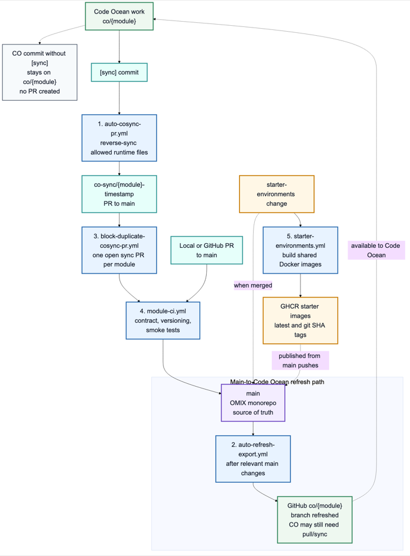
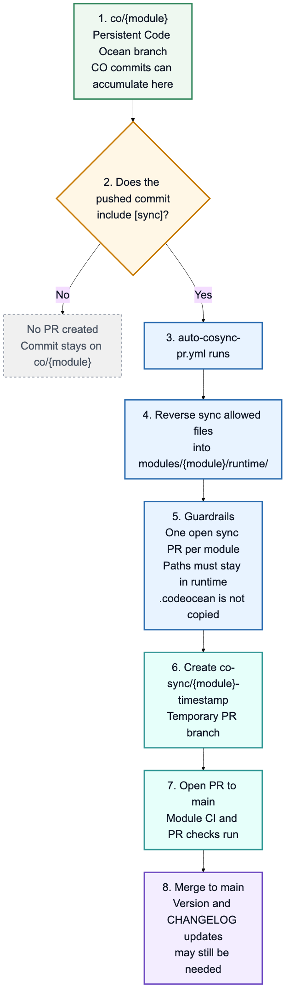
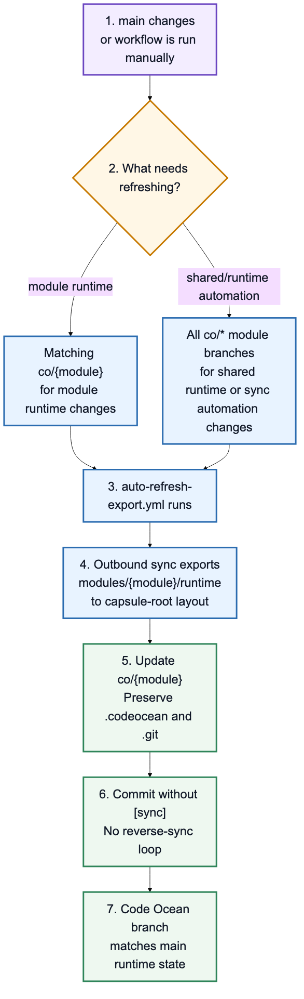
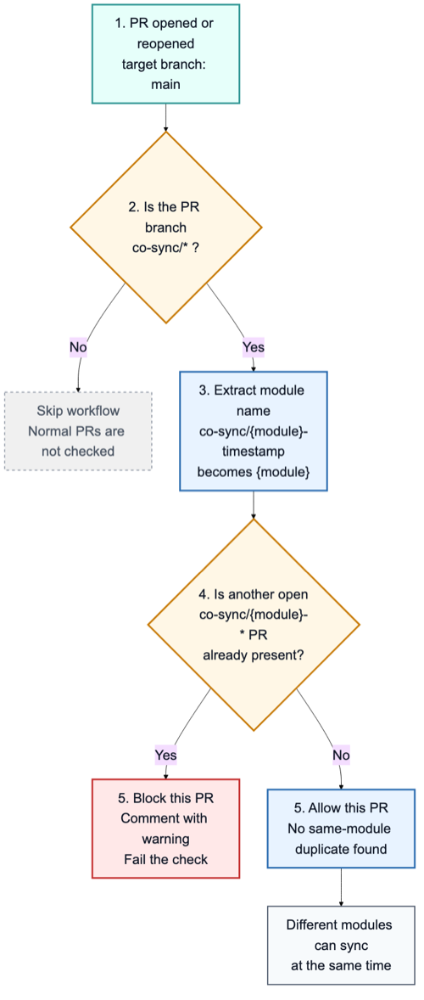
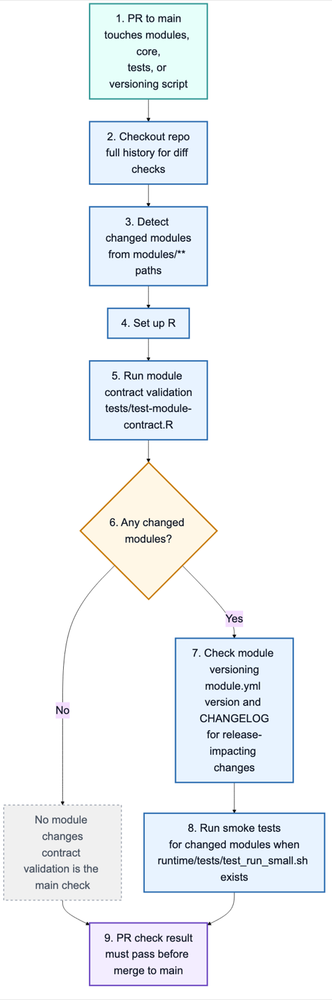
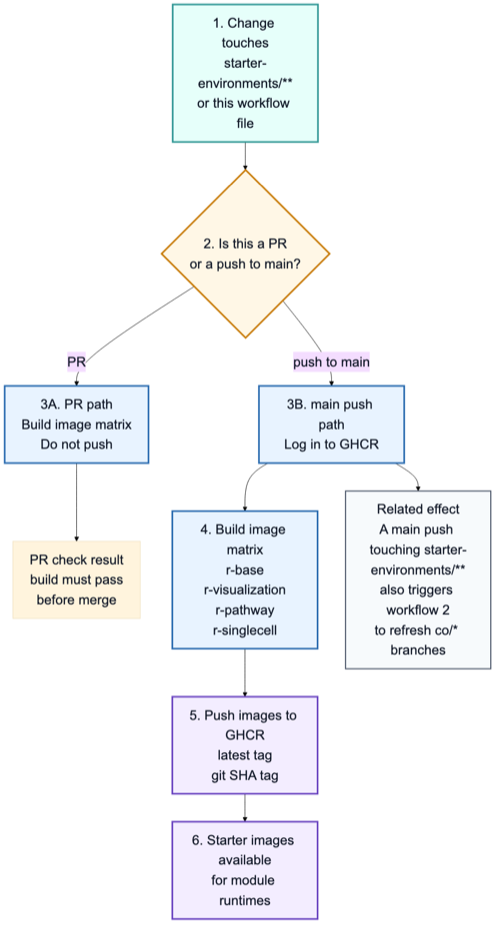

# CI Workflow Reference

This page documents the current GitHub Actions workflow files in `.github/workflows/`.

The workflows are repo governance and deployment automation. They should stay outside `core/` and `modules/`; those folders are reserved for scientific/runtime code and module-owned assets.

## Current Workflow Map

```text
Code Ocean edit
co/<module> push with [sync]
  -> auto-cosync-pr.yml
  -> co-sync/<module>-<timestamp> PR
  -> main

main push touching runtime/core/starter-env/sync automation
  -> auto-refresh-export.yml
  -> refresh co/<module> capsule branches

PR to main touching modules/core/tests/versioning script
  -> module-ci.yml
  -> contract validation, versioning, smoke tests

co-sync/* PR opened or reopened against main
  -> block-duplicate-cosync-pr.yml
  -> block duplicate sync PRs for the same module

starter-environments change
  -> starter-environments.yml
  -> build shared Docker starter images
```

Implementation note: the checked-in workflows currently route reverse-sync PRs directly to `main`. There is no checked-in `promote-mod-to-main.yml` workflow at this time. If the repo reintroduces `mod/<module>` staging branches, `auto-cosync-pr.yml`, `block-duplicate-cosync-pr.yml`, and this page should be updated together.

## Overall Workflow Diagram

Diagram source: `docs/ci-workflows-overall-flow.mmd`



## 1. `auto-cosync-pr.yml`

Workflow name: `Auto CO-Sync PR`

Purpose: bring approved Code Ocean-side edits back into the monorepo layout.

Why this exists:

The `co/<module>` branch uses a Code Ocean capsule-root layout, while `main` uses the OMIX monorepo layout. A direct PR from `co/<module>` to `main` would mix incompatible directory structures. This workflow translates approved Code Ocean edits back into only `modules/<module>/runtime/`, with scope checks around that path.

Diagram source: `docs/auto-cosync-pr-flow.mmd`



Trigger:

- Runs on pushes to `co/**` branches.
- The job only proceeds when the pushed commit message contains `[sync]`.
- WIP commits without `[sync]` are ignored.

Branch behavior:

- `co/<module>` is the persistent Code Ocean working branch. Multiple Code Ocean-side commits can accumulate there.
- A commit without `[sync]` stays on `co/<module>` and does not create a PR.
- A later commit with `[sync]` tells the workflow to reverse-sync the current allowed capsule state into a monorepo-shaped PR branch.
- `co-sync/<module>-<timestamp>` is temporary delivery branch created by automation; it is not a branch where people normally work.

What it does:

- Extracts the module name from the branch, for example `co/volcano` becomes `volcano`.
- Checks whether another open `co-sync/<module>-*` PR already exists for the same module.
- Checks out the monorepo and the matching `co/<module>` branch.
- Runs `scripts/code_ocean_sync.sh reverse <module> <co-worktree> --apply`.
- Stages only `modules/<module>/runtime`.
- Fails if any staged change escapes `modules/<module>/runtime/`.
- Estimates whether the diff is small enough to be considered fast-merge eligible.
- Creates a timestamped branch such as `co-sync/volcano-20260622-185518`.
- Opens a PR from the `co-sync/*` branch to `main`.
- Attempts to enable squash auto-merge. If auto-merge cannot be enabled, the PR is left open.

Important guardrails:

- Reverse sync is path-limited to `modules/<module>/runtime/`.
- `.codeocean/`, `.github/`, and `.git` are excluded by the sync script and are not copied back into `main`.
- Only one open co-sync PR per module is allowed.

What it does not do:

- It does not run for normal Code Ocean commits unless `[sync]` is present.
- It does not copy Code Ocean platform metadata into the monorepo.
- It does not update module versions or changelogs on its own.
- It does not currently target a `mod/<module>` staging branch.

## 2. `auto-refresh-export.yml`

Workflow name: `Auto-Refresh CO Export`

Purpose: keep persistent `co/<module>` branches current after relevant changes land on `main`.

Why this exists:

`main` is the monorepo source of truth, but Code Ocean works from persistent `co/<module>` branches. After runtime code, shared code, starter environments, or sync automation changes on `main`, the matching capsule branches need to be refreshed so Code Ocean users are not working from stale runtime files.

Diagram source: `docs/auto-refresh-export-flow.mmd`



Trigger:

- Manual `workflow_dispatch`.
- Pushes to `main` that touch:
  - `modules/*/runtime/**`
  - `core/**`
  - `starter-environments/**`
  - `.github/workflows/auto-cosync-pr.yml`
  - `.github/workflows/auto-refresh-export.yml`
  - `scripts/code_ocean_sync.sh`

What it does:

- On manual dispatch, refreshes all modules that have an `origin/co/*` branch.
- On a push to `main`, detects directly changed module runtimes.
- If shared runtime code, starter environments, or sync automation changed, refreshes all modules with `co/*` branches.
- Runs `scripts/code_ocean_sync.sh outbound <module> <export-dir> --apply`.
- Checks out the target `co/<module>` branch.
- Replaces the capsule-root payload with the exported runtime layout.
- Preserves `.codeocean/` and `.git`.
- Commits with a message like `refresh(<module>): auto-export from main (no [sync])`.

Important guardrails:

- The refresh commit intentionally omits `[sync]` to avoid a reverse-sync loop.
- `.codeocean/` is preserved as branch-local Code Ocean metadata.

What it does not do:

- It does not open a PR.
- It does not push changes to `main`.
- It does not copy unrelated modules into a capsule export.

## 3. `block-duplicate-cosync-pr.yml`

Workflow name: `Block Duplicate CO-Sync PR`

Purpose: prevent two pending reverse-sync PRs for the same module from racing each other.

Why this exists:

Two pending sync PRs for the same module can be based on different snapshots of the same `co/<module>` branch. For example, two `co-sync/volcano-*` PRs would both update `modules/volcano/runtime/`; whichever one merges first could make the second stale, conflicting, or confusing. This is true even when the two PRs contain different edits rather than identical changes.

Diagram source: `docs/block-duplicate-cosync-pr-flow.mmd`



Trigger:

- Pull requests opened or reopened against `main`.
- The job only applies when the source branch starts with `co-sync/`.

What it does:

- Extracts the module name from the `co-sync/<module>-<timestamp>` branch name.
- Searches open PRs for sibling `co-sync/<module>-*` branches.
- If another open sync PR exists for the same module, comments on the PR and fails the check.

Important guardrails:

- Duplicate protection is per module and applies to different edits as well as duplicated edits.
- Different modules can have concurrent `co-sync/*` PRs.

What it does not do:

- It does not block feature branches.
- It does not block co-sync PRs for different modules.
- It does not close duplicate PRs automatically.

## 4. `module-ci.yml`

Workflow name: `Module CI`

Purpose: validate module structure and run module-level checks for PRs that affect module/runtime code.

Why this exists:

OMIX modules are meant to be developed, tested, and released independently inside one repo. This workflow checks that changed modules still follow the module contract, that release-impacting changes update version/changelog metadata, and that available module smoke tests still run before the change reaches `main`.

Diagram source: `docs/module-ci-flow.mmd`



Trigger:

- Pull requests to `main` that touch:
  - `modules/**`
  - `core/**`
  - `tests/**`
  - `scripts/check_module_versioning.R`

What it does:

- Detects which modules changed by diffing the PR branch against the PR base SHA.
- Sets up R.
- Runs `Rscript tests/test-module-contract.R`.
- Runs `Rscript scripts/check_module_versioning.R <base-sha>` when module files changed.
- Runs each changed module's smoke test if `modules/<module>/runtime/tests/test_run_small.sh` exists.

Important guardrails:

- Contract validation runs for every triggered PR.
- Versioning is enforced for module changes targeting `main`.
- Smoke tests are discovered per changed module, so modules without a runtime smoke test are skipped rather than failed.

What it does not do:

- It does not run on direct pushes.
- It does not create releases or Git tags.
- It does not build starter environment images.
- It does not install packages outside what the tests themselves install or require.

## 5. `starter-environments.yml`

Workflow name: `Starter Environments`

Purpose: build shared Docker starter images used by module runtimes.

Why this exists:

Starter environments are shared runtime layers used by multiple modules. Building them in CI catches container or dependency failures before they affect downstream capsules, and publishing images from `main` gives modules a reusable GHCR image instead of duplicating environment setup in every module.

Diagram source: `docs/starter-environments-flow.mmd`



Trigger:

- Pull requests touching:
  - `starter-environments/**`
  - `.github/workflows/starter-environments.yml`
- Pushes to `main` touching the same paths.

What it does:

- Builds each starter environment in a matrix:
  - `r-base`
  - `r-visualization`
  - `r-pathway`
  - `r-singlecell`
- Uses Docker Buildx.
- On PRs, builds images without pushing.
- On pushes to `main`, logs in to GHCR and pushes images.
- Tags pushed images as:
  - `ghcr.io/nidap-community/omix-<starter-environment>:latest`
  - `ghcr.io/nidap-community/omix-<starter-environment>:<git-sha>`

Important guardrails:

- `fail-fast: false` lets one starter environment fail without cancelling the others immediately.
- Package publishing only happens on `main` pushes.

What it does not do:

- It does not run module smoke tests inside the built images.
- It does not update module runtime files.
- It does not refresh `co/<module>` branches by itself, although a `main` push touching `starter-environments/**` also triggers `auto-refresh-export.yml`.

## Branches and Artifacts

| Item | Role |
| --- | --- |
| `main` | Monorepo source of truth and current PR target for reverse-sync branches. |
| `co/<module>` | Persistent Code Ocean capsule-root branch for one module; CO-side commits can accumulate here until a `[sync]` commit requests reverse sync. |
| `co-sync/<module>-<timestamp>` | Temporary monorepo-shaped PR branch created by automation from the current allowed `co/<module>` state. |
| `modules/<module>/runtime/` | Only path reverse-synced from a Code Ocean capsule into the monorepo. |
| `.codeocean/` | Code Ocean platform metadata preserved on `co/<module>` and excluded from reverse sync. |
| `starter-environments/<env>/` | Shared Docker runtime definitions built by starter environment CI. |

## Common Scenarios

| Scenario | Expected automation |
| --- | --- |
| Code Ocean WIP commit without `[sync]` | No reverse-sync workflow action. |
| Several Code Ocean commits accumulate, then one commit includes `[sync]` | One `co-sync/*` PR is created from the current allowed `co/<module>` state. |
| Code Ocean commit with `[sync]` | Creates a `co-sync/*` PR to `main` and attempts auto-merge. |
| Another sync PR is already open for the same module | New sync is blocked or skipped until the first PR is merged or closed. |
| Runtime files change on `main` | Matching `co/<module>` branches are refreshed. |
| `core/`, `starter-environments/`, or sync automation changes on `main` | All modules with `co/*` branches are refreshed. |
| Starter environment PR | Starter Docker images are built but not pushed. |
| Starter environment push to `main` | Starter Docker images are built and pushed to GHCR. |

## Current Gaps and Follow-Up Decisions

- The workflows enforce module version/changelog discipline, but they do not create release tags.
- The workflows currently reverse-sync directly to `main`; they do not maintain a `mod/<module>` staging lane.
- Because reverse sync only stages `modules/<module>/runtime/`, direct `co-sync/*` PRs to `main` may still need a separate module version and changelog update before `module-ci.yml` will pass.
- Auto-merge is attempted, but GitHub branch protection or repository settings can still leave a PR open for manual action.
- Starter images are built independently from module smoke tests; adding image-backed runtime tests would be a separate CI enhancement.
